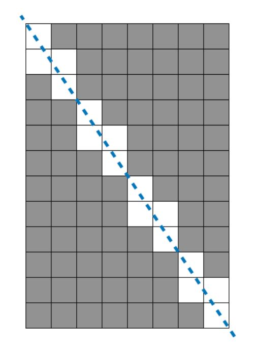

# 문제 설명

가로 길이가 Wcm, 세로 길이가 Hcm인 직사각형 종이가 있습니다. 종이에는 가로, 세로 방향과 평행하게 격자 형태로 선이 그어져 있으며, 모든 격자칸은 1cm x 1cm 크기입니다. 이 종이를 격자 선을 따라 1cm × 1cm의 정사각형으로 잘라 사용할 예정이었는데, 누군가가 이 종이를 대각선 꼭지점 2개를 잇는 방향으로 잘라 놓았습니다. 그러므로 현재 직사각형 종이는 크기가 같은 직각삼각형 2개로 나누어진 상태입니다. 새로운 종이를 구할 수 없는 상태이기 때문에, 이 종이에서 원래 종이의 가로, 세로 방향과 평행하게 1cm × 1cm로 잘라 사용할 수 있는 만큼만 사용하기로 하였습니다.
가로의 길이 W와 세로의 길이 H가 주어질 때, 사용할 수 있는 정사각형의 개수를 구하는 solution 함수를 완성해 주세요.

- 입출력 예는 다음과 같습니다.

| W    | H    | result |
| ---- | ---- | ------ |
| 8    | 12   | 80     |

가로가 8, 세로가 12인 직사각형을 대각선 방향으로 자르면 총 16개 정사각형을 사용할 수 없게 됩니다. 원래 직사각형에서는 96개의 정사각형을 만들 수 있었으므로, 96 - 16 = 80 을 반환합니다.

- 제한사항

  W, H : 1억 이하의 자연수

# 문제 풀이

- **규칙**

1) w * w 정사각형일 때 w개의 사각형이 잘립니다.
2) w, h 둘 중 하나의 길이가 1이면 모든 사각형이 잘립니다.
3) 1번과 2번의 경우를 제외한 나머지 경우의 규칙

       3-1.  w = 2, h = 3일 때, 4개 out       # 최대공약수 : 1
      
       3-2.  w = 2, h = 4일 때, 4개 out       # 최대공약수 : 2
      
       3-3.  w = 2, h = 5일 때, 6개 out       # 최대공약수 : 1
      
       3-4.  w = 2, h = 6일 때, 6개 out       # 최대공약수 : 2
      
       3-5.  w = 2, h = 7일 때, 8개 out       # 최대공약수 : 1
      
       3-6.  w = 2, h = 8일 때, 8개 out       # 최대공약수 : 2

  

  - 이를 통해 다음과 같은 규칙을 정의할 수 있습니다.
    - w와 h의 최대공약수가 1이라면, (w + h - 1)개 out
    - w와 h의 최대공약수가 1보다 크다면, (w + h - 최대공약수)개 out

# 제출 코드

    def solution(w,h):
        lst = []
        if w == h: return w*h-w
        elif w == 1 or h == 1: return 0
        
        for i in range(1,w+1):
            if w%i == 0: lst.append(i)
        for i in range(1,h+1):
            if h%i == 0: lst.append(i)
                
        for i in sorted(lst,reverse=True):
            if lst.count(i) == 2 and i>1:
                return (w*h)-(w+h-i)
            elif lst.count(i) == 2 and i==1:
                return (w*h)-(w+h-1)