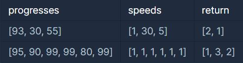

# 문제 설명

프로그래머스 팀에서는 기능 개선 작업을 수행 중입니다. 각 기능은 진도가 100%일 때 서비스에 반영할 수 있습니다.

또, 각 기능의 개발속도는 모두 다르기 때문에 뒤에 있는 기능이 앞에 있는 기능보다 먼저 개발될 수 있고, 이때 뒤에 있는 기능은 앞에 있는 기능이 배포될 때 함께 배포됩니다.

먼저 배포되어야 하는 순서대로 작업의 진도가 적힌 정수 배열 progresses와 각 작업의 개발 속도가 적힌 정수 배열 speeds가 주어질 때 각 배포마다 몇 개의 기능이 배포되는지를 return 하도록 solution 함수를 완성하세요.

- 제한사항

  - 작업의 개수(progresses, speeds배열의 길이)는 100개 이하입니다.
  
  - 작업 진도는 100 미만의 자연수입니다.
  
  - 작업 속도는 100 이하의 자연수입니다.
  
  - 배포는 하루에 한 번만 할 수 있으며, 하루의 끝에 이루어진다고 가정합니다. 예를 들어 진도율이 95%인 작업의 개발 속도가 하루에 4%라면 배포는 2일 뒤에 이루어집니다.
  
    

- 입출력 예는 다음과 같습니다.

  

- 입출력 예#1

  첫 번째 기능은 93% 완료되어 있고 하루에 1%씩 작업이 가능하므로 7일간 작업 후 배포가 가능합니다.
  두 번째 기능은 30%가 완료되어 있고 하루에 30%씩 작업이 가능하므로 3일간 작업 후 배포가 가능합니다. 하지만 이전 첫 번째 기능이 아직 완성된 상태가 아니기 때문에 첫 번째 기능이 배포되는 7일째 배포됩니다.
  세 번째 기능은 55%가 완료되어 있고 하루에 5%씩 작업이 가능하므로 9일간 작업 후 배포가 가능합니다.

  따라서 7일째에 2개의 기능, 9일째에 1개의 기능이 배포됩니다.

  

- 입출력 예#2

  모든 기능이 하루에 1%씩 작업이 가능하므로, 작업이 끝나기까지 남은 일수는 각각 5일, 10일, 1일, 1일, 20일, 1일입니다. 어떤 기능이 먼저 완성되었더라도 앞에 있는 모든 기능이 완성되지 않으면 배포가 불가능합니다.

  따라서 5일째에 1개의 기능, 10일째에 3개의 기능, 20일째에 2개의 기능이 배포됩니다.

# 문제 풀이

- **규칙**

  - 각 작업에 대해 하루에 speed만큼 작업하여 progresses가 100이 되면 배포합니다.

  - 단, 배포하는데 걸린 기간이 앞선 progresses의 배포 기간보다 짧으면 안됩니다.
  - 이전의 progresses가 먼저 배포되어야 다음 progresses가 배포될 수 있습니다.
  
    - 따라서 list를 생성하여 각 progresses의 배포 기간을 저장하되, 앞선 progresses의 배포기간이 뒷 progresses의 배포기간보다 더 길 경우, 뒷 progresses는 앞선 progresses의 배포 기간과 동일하게 저장합니다.
    - 그 후 중복된 기간의 수를 세어 출력합니다.

# 제출 코드

    from collections import defaultdict
    
    def solution(progresses, speeds):
        pass_lst=[0]*len(progresses)
        count, answer = defaultdict(int), []
    
        for i in range(len(progresses)):
            for k in range(1,100):
                if progresses[i] + (speeds[i]*k) >=100:
                    if pass_lst[i-1]>k: pass_lst[i]=pass_lst[i-1]
                    else: pass_lst[i]=k
                    count[pass_lst[i]] +=1
                    break
    
        for v in count.values(): answer.append(v)
        return answer
