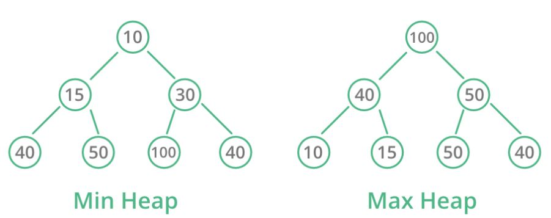

# 문제 설명

매운 것을 좋아하는 Leo는 모든 음식의 스코빌 지수를 K 이상으로 만들고 싶습니다. 모든 음식의 스코빌 지수를 K 이상으로 만들기 위해 Leo는 스코빌 지수가 가장 낮은 두 개의 음식을 아래와 같이 특별한 방법으로 섞어 새로운 음식을 만듭니다.

```
섞은 음식의 스코빌 지수 = 가장 맵지 않은 음식의 스코빌 지수 + (두 번째로 맵지 않은 음식의 스코빌 지수 * 2)
```

Leo는 모든 음식의 스코빌 지수가 K 이상이 될 때까지 반복하여 섞습니다.
Leo가 가진 음식의 스코빌 지수를 담은 배열 scoville과 원하는 스코빌 지수 K가 주어질 때, 모든 음식의 스코빌 지수를 K 이상으로 만들기 위해 섞어야 하는 최소 횟수를 return 하도록 solution 함수를 작성해주세요.


- 제한사항

  - scoville의 길이는 2 이상 1,000,000 이하입니다.
  
  - K는 0 이상 1,000,000,000 이하입니다.
  
  - scoville의 원소는 각각 0 이상 1,000,000 이하입니다.
  
  - 모든 음식의 스코빌 지수를 K 이상으로 만들 수 없는 경우에는 -1을 return 합니다.
  
    

- 입출력 예

  | scoville             | K    | return |
  | -------------------- | ---- | ------ |
  | [1, 2, 3, 9, 10, 12] | 7    | 2      |

  1. 스코빌 지수가 1인 음식과 2인 음식을 섞으면 음식의 스코빌 지수가 아래와 같이 됩니다.
     새로운 음식의 스코빌 지수 = 1 + (2 * 2) = 5
     가진 음식의 스코빌 지수 = [5, 3, 9, 10, 12]

  2. 스코빌 지수가 3인 음식과 5인 음식을 섞으면 음식의 스코빌 지수가 아래와 같이 됩니다.
     새로운 음식의 스코빌 지수 = 3 + (5 * 2) = 13
     가진 음식의 스코빌 지수 = [13, 9, 10, 12]

     

  모든 음식의 스코빌 지수가 7 이상이 되었고 이때 섞은 횟수는 2회입니다.

  

# 문제 풀이

- **heap 활용**

  

  heap은 최댓값과 최솟값을 빠르게 찾기 위해 고안되었으며, 완전이진트리를 기본으로 합니다.

  - 최소 힙 : 부모 노드의 키 값이 자식 노드의 키 값보다 항상 작은 힙

  - 최대 힙 : 부모 노드의 키 값이 자식 노드의 키 값보다 항상 큰 힙

    

- **최소 힙 활용**

  - (python) import heapq : list를 최소 힙처럼 다룰 수 있다.

  - heapify() : 기존 list를 최소 힙으로 변환

  - heappush(list, 요소) : heap에 요소 추가

  - heappop(list) : heap의 가장 작은 요소 하나를 삭제한 뒤 반환

    


- **코드**

     1.    입력받은 list 'scoville'을 min heap으로 변환합니다.
     
     2.    scoville의 최소 값(노드 값)이 K보다 커질 때 까지 계속해서 값을 갱신(섞어줍니다)합니다.
     
     3.    'heapq.heappop(scoville) + heapq.heappop(scoville)' 은 'scoville의 가장 작은 값 + 두번째로 작은 값'을 의미합니다.
     
     4.    두 음식을 섞어 새로운 scoville(new)를 만들고 heappush()를 통해 scoville을 갱신합니다.
     
     5.    한 번 갱신할 때마다 cnt+=1를 진행하여 갱신 횟수를 기록합니다.
     
     6.    만약 scoville의 가장 작은 수가 K보다 크다면 문제의 조건(모든 음식의 스코빌 지수를 K이상으로 만든다)을 만족하므로 return cnt로 함수를 종료합니다.
     
     7.    만약 scoville의 길이가 1 즉, 더이상 갱신이 불가능하며 scoville의 가장 작은 수가 K보다 작다면 문제의 조건을 만족하는 것이 불가능하므로 return -1로 함수를 종료합니다. 


# 제출 코드


    import heapq
    
    def solution(scoville, K):
        heapq.heapify(scoville)
        cnt = 0
        
        while scoville[0] < K:     
            new = heapq.heappop(scoville) + (heapq.heappop(scoville) * 2)
            heapq.heappush(scoville, new)
            cnt += 1
            
            if scoville[0] > K: return cnt
            if len(scoville) == 1 and scoville[0] < K: return -1
